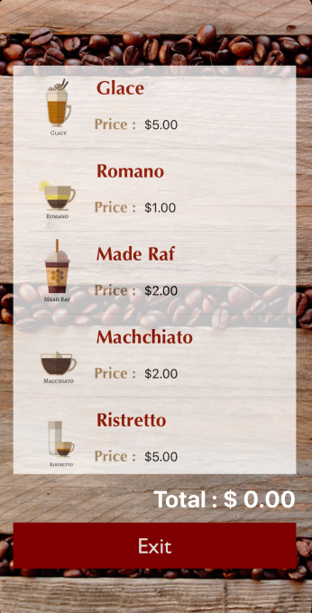
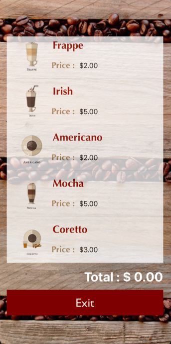
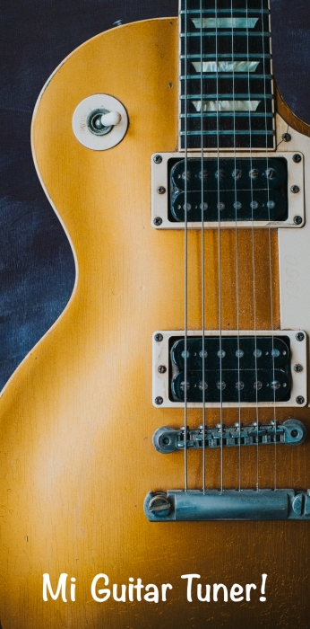
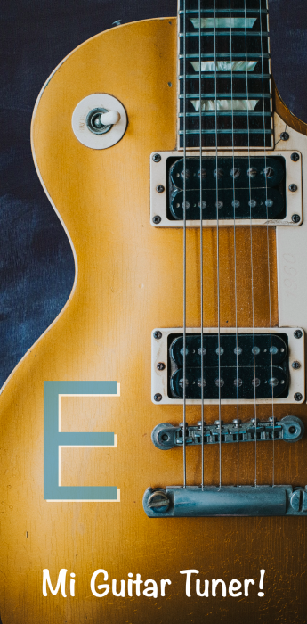
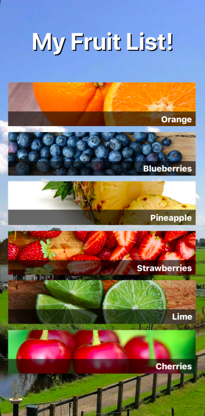
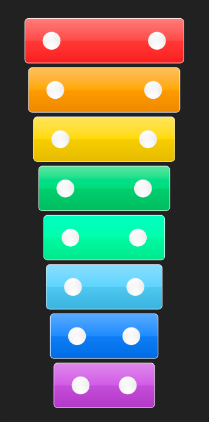

# Coffee Shop

Guitar Tuner es una aplicación que funciona como un afinador de Guitarra, al tocar cada cuerda de la guitarra en la interfaz, despliega el sonido de la nota que corresponde mostrando el acorde.

## Construido con 🛠️

* [AudioToolBox](https://developer.apple.com/documentation/audiotoolbox) - Framework de Sonido
* [Autolayout](https://developer.apple.com/library/archive/documentation/UserExperience/Conceptual/AutolayoutPG/index.html) - Manejador de constrains.

## Repositorio 📖

[GuitarTuner](https://github.com/YenniferHurtado/guitarTuner-app-swift) - Github Code

&nbsp;&nbsp;&nbsp;&nbsp;&nbsp;

&nbsp;&nbsp;&nbsp;&nbsp;&nbsp;

# Guitar Tuner

Guitar Tuner es una aplicación que funciona como un afinador de Guitarra, al tocar cada cuerda de la guitarra en la interfaz, despliega el sonido de la nota que corresponde mostrando el acorde.

## Construido con 🛠️

* [AudioToolBox](https://developer.apple.com/documentation/audiotoolbox) - Framework de Sonido
* [Autolayout](https://developer.apple.com/library/archive/documentation/UserExperience/Conceptual/AutolayoutPG/index.html) - Manejador de constrains.

## Repositorio 📖

[GuitarTuner](https://github.com/YenniferHurtado/guitarTuner-app-swift) - Github Code

&nbsp;&nbsp;&nbsp;&nbsp;&nbsp;

&nbsp;&nbsp;&nbsp;&nbsp;&nbsp;

# Fruit List

Guitar Tuner es una aplicación que funciona como un afinador de Guitarra, al tocar cada cuerda de la guitarra en la interfaz, despliega el sonido de la nota que corresponde mostrando el acorde.

## Construido con 🛠️

* [AudioToolBox](https://developer.apple.com/documentation/audiotoolbox) - Framework de Sonido
* [Autolayout](https://developer.apple.com/library/archive/documentation/UserExperience/Conceptual/AutolayoutPG/index.html) - Manejador de constrains.

## Repositorio 📖

[GuitarTuner](https://github.com/YenniferHurtado/guitarTuner-app-swift) - Github Code

&nbsp;&nbsp;&nbsp;&nbsp;&nbsp;

&nbsp;&nbsp;&nbsp;&nbsp;&nbsp;

# Xylophone

Guitar Tuner es una aplicación que funciona como un afinador de Guitarra, al tocar cada cuerda de la guitarra en la interfaz, despliega el sonido de la nota que corresponde mostrando el acorde.

## Construido con 🛠️

* [AudioToolBox](https://developer.apple.com/documentation/audiotoolbox) - Framework de Sonido
* [Autolayout](https://developer.apple.com/library/archive/documentation/UserExperience/Conceptual/AutolayoutPG/index.html) - Manejador de constrains.

## Repositorio 📖

[GuitarTuner](https://github.com/YenniferHurtado/guitarTuner-app-swift) - Github Code

&nbsp;&nbsp;&nbsp;&nbsp;&nbsp;

&nbsp;&nbsp;&nbsp;&nbsp;&nbsp;

## Thanks for stopping by!

# Contact Info:

- Email: yennifer.hurtadoarce@gmail.com
- LinkedIn: [YenniferHurtado](https://www.linkedin.com/in/yenniferhurtado/)
- Website: [msin-tech](https://msin-tech.com/)