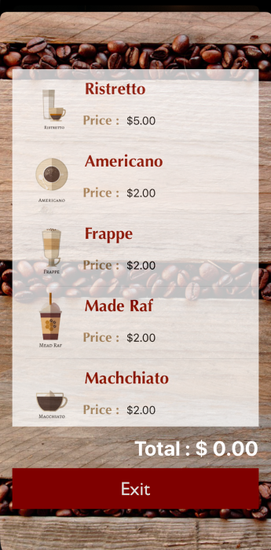
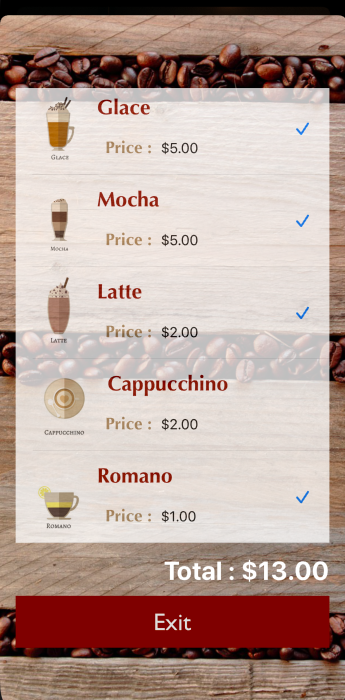

# Coffee Shop

App iOS - carrito de compras de diferentes tipos de café, añade el producto y suma el montó total a pagar. 
Uso de Segues, UiTableView para customizar los elementos. MainStoryBoard, Contrains, CocoaTouchClass, UiTableViewCell y NavigationController para las navegaciones de pantalla.

## Construido con 🛠️

* [UiKit](https://developer.apple.com/documentation/uikit) 
* [UiTableView](https://developer.apple.com/documentation/uikit/uitableview) 
* [UiTableViewCell](https://developer.apple.com/documentation/uikit/uitableviewcell) 
* [NavigationController](https://developer.apple.com/documentation/uikit/uinavigationcontroller) 
* [CocoaTouchClass](https://developer.apple.com/library/archive/documentation/General/Conceptual/DevPedia-CocoaCore/Cocoa.html) 
* [Autolayout](https://developer.apple.com/library/archive/documentation/UserExperience/Conceptual/AutolayoutPG/index.html) 
* [Segues](https://developer.apple.com/library/archive/featuredarticles/ViewControllerPGforiPhoneOS/UsingSegues.html) 

## Repositorio 📖
[Coffee Shop](https://github.com/YenniferHurtado/coffee-shop-iOS) 

&nbsp;&nbsp;&nbsp;&nbsp;&nbsp;

&nbsp;&nbsp;&nbsp;&nbsp;&nbsp;

# Guitar Tuner

Afinador de Guitarra, aplicando diferentes métodos de la librería UiKit, para darle vida a las cuerdas de la imagen. Y uso del Api de sonido para reproducir el audio correspondiente a la nota presionada.

## Construido con 🛠️

* [AudioToolBox](https://developer.apple.com/documentation/audiotoolbox) - Framework de Sonido
* [Autolayout](https://developer.apple.com/library/archive/documentation/UserExperience/Conceptual/AutolayoutPG/index.html) 
* [Constrains](https://developer.apple.com/documentation/uikit/uiview/1622464-constraints) 
* [UiKit](https://developer.apple.com/documentation/uikit) 

## Repositorio 📖

[GuitarTuner](https://github.com/YenniferHurtado/guitarTuner-app-swift) - Github Code

&nbsp;&nbsp;&nbsp;&nbsp;&nbsp;

&nbsp;&nbsp;&nbsp;&nbsp;&nbsp;

# Fruit List

Cuerpo de una Apps totalmente visual, interfaceBuilder, posicionamiento de pantallas con coordenadas X, Y. Márgenes y constrains, resolución de diferentes vistas. Icono de la App en Applcon de Assets.

## Construido con 🛠️

* [InterfaceBuilder](https://developer.apple.com/xcode/interface-builder/) 
* [Autolayout](https://developer.apple.com/library/archive/documentation/UserExperience/Conceptual/AutolayoutPG/index.html) 
* [Constrains](https://developer.apple.com/documentation/uikit/uiview/1622464-constraints) 
* [UiKit](https://developer.apple.com/documentation/uikit) 
* [AppIcon](https://medium.com/@craiggrummitt/xcode-whats-up-with-app-icons-308b3f10e942) - App Icon Generator

## Repositorio 📖

[FruitList](https://github.com/YenniferHurtado/fruitListapplication-swift) 

&nbsp;&nbsp;&nbsp;&nbsp;&nbsp;

&nbsp;&nbsp;&nbsp;&nbsp;&nbsp;

# Xylophone

Aplicación de juego con animaciones en los bótones. IBDesignable, IBInspectable.

## Construido con 🛠️

* [StackView](https://developer.apple.com/documentation/uikit/uistackview) 
* [Autolayout](https://developer.apple.com/library/archive/documentation/UserExperience/Conceptual/AutolayoutPG/index.html) 
* [Movimiento de bótones](https://developer.apple.com/library/archive/documentation/UserExperience/Conceptual/AutolayoutPG/index.html) 

## Repositorio 📖

[XiloPhone](https://github.com/YenniferHurtado/xiloPhone-iOS) 

&nbsp;&nbsp;&nbsp;&nbsp;&nbsp;

&nbsp;&nbsp;&nbsp;&nbsp;&nbsp;

## Thanks for stopping by!

# Contact Info:

- Email: yennifer.hurtadoarce@gmail.com
- LinkedIn: [YenniferHurtado](https://www.linkedin.com/in/yenniferhurtado/)
- Website: [msin-tech](https://msin-tech.com/)